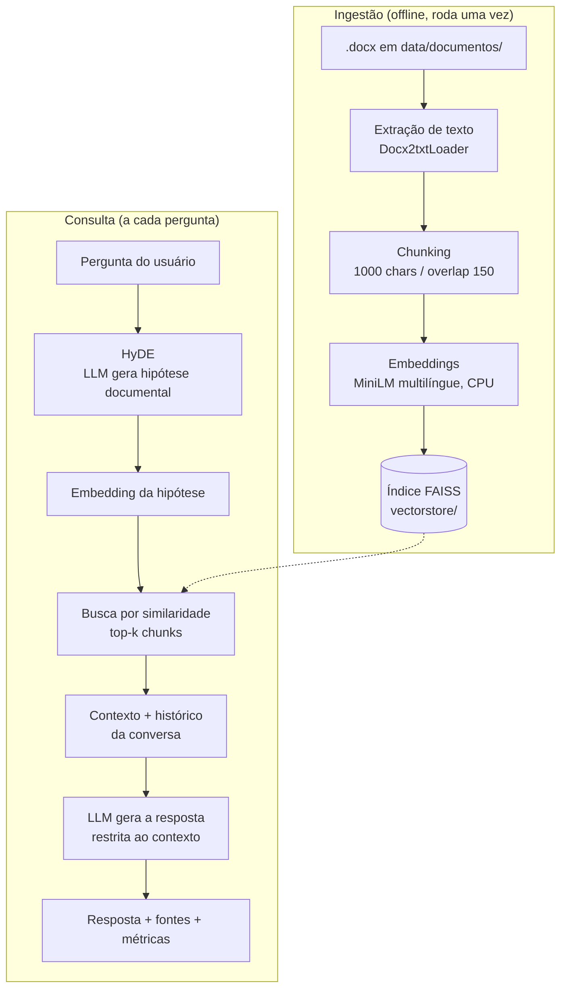

# Chatbot RAG com HyDE — ICMS/SP

Chatbot que responde perguntas sobre legislação de ICMS de São Paulo usando
apenas o conteúdo de documentos indexados localmente, com recuperação
aumentada por HyDE (Hypothetical Document Embeddings).

## Problema

Consultar legislação tributária significa procurar um trecho específico em
material extenso: o RICMS/2000 (Decreto 45.490), a Lei 6.374/1989, tabelas de
IVA-ST, fórmulas de base de cálculo. Duas alternativas óbvias falham:

- **Busca por palavra-chave** não encontra nada quando a pergunta usa
  vocabulário diferente do texto legal. Quem pergunta "qual o prazo pra
  contestar o preço publicado?" não escreve "impugnação do percentual
  constante no levantamento de preços".
- **LLM sem fontes** responde com texto plausível, mas inventa número de
  artigo, percentual e prazo quando não sabe. Em conteúdo fiscal, uma resposta
  errada com aparência de certa é pior que nenhuma resposta.

Este projeto ataca os dois: recupera os trechos relevantes por similaridade
semântica e obriga o modelo a responder somente com base neles, declarando
explicitamente quando a informação não está nos documentos.

## Como funciona



### As etapas

**1. Ingestão** ([src/ingestion.py](src/ingestion.py)) — lê os `.docx` de
`data/documentos/` e extrai o texto.

**2. Chunking** — divide cada documento em trechos de 1000 caracteres com 150
de sobreposição (`RecursiveCharacterTextSplitter`). A sobreposição evita que
uma informação partida entre dois trechos fique incompleta nos dois, o que
importa em texto legal, onde um artigo pode ocupar vários parágrafos. Os dois
documentos atuais geram **134 chunks**.

**3. Embeddings** ([src/embeddings.py](src/embeddings.py)) — cada chunk é
convertido em vetor por `paraphrase-multilingual-MiniLM-L12-v2`, que roda
localmente em CPU. Sem chamada de API nesta etapa, portanto sem custo por
documento indexado.

**4. Armazenamento vetorial** — os vetores vão para um índice FAISS gravado em
`vectorstore/`. O índice já vem pronto no repositório, então é possível rodar
o chatbot sem reindexar.

**5. HyDE** ([src/generation.py](src/generation.py)) — antes de buscar, o LLM
transforma a pergunta em uma *hipótese documental*: um trecho curto escrito no
estilo e no vocabulário que um documento sobre o assunto provavelmente teria.
A busca vetorial é feita com o embedding dessa hipótese, não da pergunta
original.

O motivo é o desalinhamento de vocabulário: a pergunta do usuário é curta e
coloquial, o documento é longo e formal, e o embedding de uma pergunta fica
distante do embedding do trecho que a responde. A hipótese aproxima a consulta
do texto real da fonte. O prompt do HyDE
([src/prompts.yaml](src/prompts.yaml)) proíbe explicitamente inventar números,
artigos e datas — a hipótese serve só como consulta de busca e nunca é
apresentada ao usuário como informação.

**6. Recuperação** ([src/retrieval.py](src/retrieval.py)) — busca os `k`
chunks mais similares (padrão 5, ajustável na interface) e monta o bloco de
contexto identificando o arquivo de origem de cada trecho.

**7. Geração** ([src/generation.py](src/generation.py)) — o contexto, a
pergunta e os últimos 5 turnos da conversa vão para o LLM com um prompt que
restringe a resposta ao contexto recuperado e manda declarar
`"A informação não foi encontrada na documentação disponibilizada."` quando o
contexto não cobre a pergunta.

Cada pergunta faz **duas chamadas ao LLM** (hipótese HyDE e resposta final).
O pipeline mede o tempo de cada etapa e soma os tokens reais devolvidos pela
API, exibindo latência, tokens e custo estimado a cada resposta.

### Prompts versionados

Os dois prompts ficam em [src/prompts.yaml](src/prompts.yaml), cada um com uma
chave de versão e um `default`. [src/prompts.py](src/prompts.py) carrega a
versão pedida e valida que o template contém todos os placeholders
obrigatórios, falhando na carga em vez de na chamada da API. Permite testar
variações de prompt sem alterar código.

### Avaliação

[eval/evaluate_retrieval.py](eval/evaluate_retrieval.py) mede **recall@k**
sobre 12 perguntas de ICMS/SP ([eval/dataset.json](eval/dataset.json)),
escritas a partir do conteúdo real dos documentos, cada uma com palavras-chave
que devem aparecer nos chunks recuperados. Não usa o LLM, então roda sem chave
de API e isola a qualidade do índice e do chunking.

Resultado da última execução (k=5, busca direta sem HyDE): **11 de 12
perguntas** com pelo menos uma palavra-chave esperada nos chunks recuperados,
com média de 0,21s por busca. A falha é a q05 ("Quando falta o valor da
operação, quais critérios substitutos são usados para a base de cálculo?"), em
que o top-5 não trouxe os trechos com "FOB" e "mercado atacadista". Detalhe
por pergunta em [eval/resultado_retrieval.json](eval/resultado_retrieval.json).

[eval/evaluate_generation.py](eval/evaluate_generation.py) roda o pipeline
completo e registra resposta, latência por etapa, tokens e custo por pergunta.
Requer chave de API, e por isso ainda não foi executado — não há resultados de
geração medidos neste repositório.

## Stack

| Camada | Escolha |
|---|---|
| Orquestração | LangChain (`langchain-core`, `-community`, `-text-splitters`) |
| Embeddings | `sentence-transformers/paraphrase-multilingual-MiniLM-L12-v2`, local em CPU |
| Índice vetorial | FAISS (`faiss-cpu`), em disco |
| LLM | `openai/gpt-oss-20b` via OpenRouter (`langchain-openai`) |
| Ingestão | `docx2txt` |
| Interface | Streamlit |
| Configuração | `python-dotenv` (`.env`) e `PyYAML` (prompts) |

Notas sobre as escolhas:

- **FAISS local** em vez de vector database gerenciado: o corpus tem 2
  documentos e 134 chunks. Não há volume que justifique infraestrutura extra.
- **Embeddings locais** em vez de API de embeddings: o modelo é pequeno o
  suficiente para rodar em CPU e elimina custo por token na indexação.
- **OpenRouter** expõe uma API compatível com a da OpenAI, o que permite reusar
  o cliente `ChatOpenAI` e trocar de modelo alterando a variável `MODEL` no
  `.env`, sem mexer no código.

## Estrutura de pastas

```
rag-legislacao-fiscal/
├── src/
│   ├── config.py           # caminhos, modelos e variáveis de ambiente
│   ├── ingestion.py        # carga dos .docx, chunking e construção do índice
│   ├── embeddings.py       # modelo de embeddings e leitura do índice FAISS
│   ├── retrieval.py        # busca semântica e formatação do contexto
│   ├── generation.py       # chamadas ao LLM (hipótese HyDE e resposta final)
│   ├── pipeline.py         # orquestração de ponta a ponta
│   ├── prompts.py          # carga e validação dos prompts
│   └── prompts.yaml        # templates versionados (HyDE e resposta)
├── app/
│   ├── streamlit_app.py    # interface web
│   └── cli.py              # interface de linha de comando
├── data/
│   └── documentos/         # fontes .docx de ICMS/SP
├── vectorstore/            # índice FAISS pré-construído
├── eval/
│   ├── dataset.json              # 12 perguntas com palavras-chave esperadas
│   ├── evaluate_retrieval.py     # recall@k, sem custo de API
│   ├── evaluate_generation.py    # pipeline completo, requer API key
│   └── resultado_retrieval.json  # saída da última avaliação de recuperação
├── requirements.txt
└── .env.example
```

## Como rodar

Requisitos: Python 3.11 ou superior (testado em 3.13) e uma chave de API da
[OpenRouter](https://openrouter.ai/keys).

### 1. Clonar o repositório

```bash
git clone https://github.com/brunodt98/rag-legislacao-fiscal.git
cd rag-legislacao-fiscal
```

### 2. Criar o ambiente virtual e instalar as dependências

Linux / macOS:

```bash
python -m venv .venv
source .venv/bin/activate
pip install -r requirements.txt
```

Windows (PowerShell):

```powershell
python -m venv .venv
.venv\Scripts\Activate.ps1
pip install -r requirements.txt
```

> No Windows, se a instalação falhar com `OSError: [WinError 206]`, crie o
> ambiente virtual em um caminho curto (ex.: `python -m venv C:\venv\chatbot`).
> O PyTorch, trazido pelo `sentence-transformers`, tem arquivos internos com
> caminhos longos que estouram o limite de 260 caracteres do Windows.

### 3. Configurar a chave de API

```bash
cp .env.example .env
```

No Windows: `Copy-Item .env.example .env`.

Preencha `OPENROUTER_API_KEY` no `.env`. As outras variáveis são opcionais e
têm valores padrão em [src/config.py](src/config.py).

### 4. Rodar a interface web

```bash
streamlit run app/streamlit_app.py
```

Abre em `http://localhost:8501`. A chave de API também pode ser colada na
barra lateral, que permite ainda trocar o modelo, a temperatura e o número de
documentos recuperados (`k`).

### 5. Rodar pela linha de comando (opcional)

```bash
python app/cli.py
```

### 6. Reconstruir o índice (opcional)

O índice em `vectorstore/` já vem pronto. Só é preciso reconstruir ao
adicionar ou trocar documentos em `data/documentos/`:

```bash
python -m src.ingestion
```

### 7. Rodar as avaliações

```bash
python eval/evaluate_retrieval.py     # recall@k, não consome API
python eval/evaluate_generation.py    # pipeline completo, requer API key
```

## Limitações e próximos passos

- **O ganho do HyDE não está medido.** A avaliação de recuperação roda só a
  busca direta; falta comparar recall@k com e sem HyDE nas mesmas 12 perguntas
  para quantificar o efeito. Hoje a justificativa do HyDE é conceitual.
- **`evaluate_generation.py` nunca foi executado**, então não há números de
  assertividade, latência de ponta a ponta nem custo real por pergunta.
- **Avaliação por palavra-chave é um proxy.** Verificar se um termo aparece no
  chunk ou na resposta não confirma que a resposta está correta nem que a
  interpretação da norma procede. Uma avaliação mais sólida exigiria revisão
  humana das respostas.
- **Corpus pequeno** (2 documentos, 134 chunks). Com uma base maior valeria
  reavaliar `chunk_size` e `k`, e guardar metadados por chunk (número do
  artigo, data de vigência) para permitir citação precisa em vez de citar só o
  arquivo de origem.
- **Sem re-ranking depois do FAISS.** Um cross-encoder reordenando os top-k
  tende a ajudar em casos como a q05, onde vários trechos falam de "base de
  cálculo" e o mais específico não entra no top-5.
- **Sem testes automatizados.** O código é validado hoje pelos scripts de
  avaliação e pela execução manual das interfaces.
- **Preço estimado, não faturado.** O custo mostrado na interface usa valores
  de referência definidos no `.env`; o valor real cobrado depende do provedor
  que a OpenRouter roteia no momento.

## Autor

**Bruno Silva** — Ciência de Dados, Fatec Cotia
[linkedin.com/in/brunosilva09](https://linkedin.com/in/brunosilva09)
